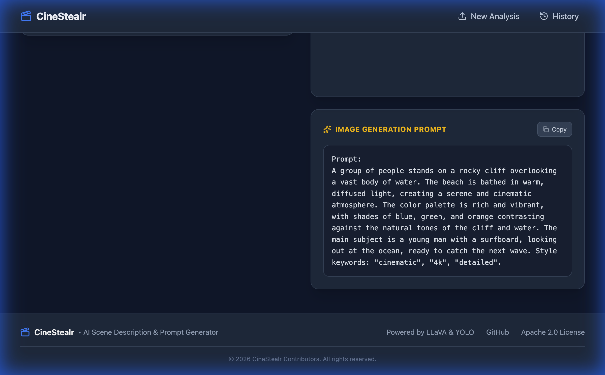

# CineStealr

Local AI application for generating cinematic scene descriptions and image prompts from images using LLaVA and YOLO.

## Features

- 🎬 **Scene Analysis** - Upload images and get detailed cinematic descriptions
- ✨ **Image Prompt Generation** - Create AI image generation prompts for Stable Diffusion, DALL-E, Midjourney
- 🚀 **Metal GPU Acceleration** - Native support for Apple Silicon (M1/M2/M3/M4/M5)
- 📋 **Copy to Clipboard** - One-click copy for generated prompts
- 📜 **History** - Browse and revisit previous analyses

## Screenshots

### Upload Page


### Analysis History


### Real-Time Streaming Analysis


### Scene Analysis & Prompt Generation


### Generated AI Prompt


## Quick Start

### macOS (Apple Silicon) - Recommended

```bash
# First-time setup (downloads ~4.5GB of AI models)
./cinestealr.sh setup

# Start with Metal GPU acceleration
./cinestealr.sh start
```

### Linux / Intel Mac

```bash
# First-time setup
./cinestealr.sh setup

# Start in container mode (CPU)
./cinestealr.sh start --container
```

### Manual Setup (Optional)

If you cannot run `./cinestealr.sh setup`, you must download the models manually:

1. Create `docker/models` directory.
2. Download [LLaVA v1.5 7B (Q4_K_M)](https://huggingface.co/second-state/Llava-v1.5-7B-GGUF/resolve/main/llava-v1.5-7b-Q4_K_M.gguf) to `docker/models/`.
3. Download [Projector (mmproj-model-f16)](https://huggingface.co/second-state/Llava-v1.5-7B-GGUF/resolve/main/llava-v1.5-7b-mmproj-model-f16.gguf) to `docker/models/`.

### Manual Start (Docker / Podman Compose)

If you prefer not to use the helper script, you can run the commands manually.

#### 1. Native Mac (Default)
For M1/M2/M3 chips with Metal GPU acceleration:

```bash
# 1. Start the native LLM server
./start_llm.sh &

# 2. Start the Backend & Frontend (using podman-compose.native.yml)
# Note: podman-compose.native.yml excludes the containerized LLM service
podman compose -f podman-compose.native.yml up -d
```

#### 2. OpenAI Configuration
To run with OpenAI and skip the local model entirely:

```bash
# 1. Set Environment Variables
export INIT_LLM_PROVIDER=openai
export INIT_LLM_API_KEY=sk-your-key-here
export INIT_LLM_MODEL=gpt-4-vision-preview

# 2. Start Backend & Frontend
# We use the native yaml because we don't want to start a local LLM container
podman compose -f podman-compose.native.yml up -d
```

#### 3. Standard Container Mode (Linux / Intel Mac)
To run everything (LLM + Backend + Frontend) inside containers (CPU only):

**Using Docker Compose:**
```bash
docker compose -f podman-compose.yml up -d
```

**Using Podman Compose:**
```bash
podman-compose -f podman-compose.yml up -d
```

## Commands

| Command | Description |
|---------|-------------|
| `./cinestealr.sh setup` | First-time setup (download models, install deps) |
| `./cinestealr.sh start` | Start all services (auto-detects best mode) |
| `./cinestealr.sh start --native` | Force native LLM with Metal GPU |
| `./cinestealr.sh start --container` | Force containerized LLM (CPU only) |
| `./cinestealr.sh stop` | Stop all services |
| `./cinestealr.sh status` | Show service status |

## Options

| Option | Description |
|--------|-------------|
| `--native` | Use native LLM with Metal GPU (macOS only) |
| `--container` | Use containerized LLM (CPU only) |
| `--docker` | Use Docker instead of Podman |
| `--podman` | Use Podman (default) |

## URLs

| Service | URL |
|---------|-----|
| Frontend | http://localhost:5173 |
| Backend API | http://localhost:8000 |
| LLM Server | http://localhost:8080 |

## Requirements

### macOS (Native Mode)
- macOS 12+ with Apple Silicon (M1/M2/M3/M4/M5)
- [Homebrew](https://brew.sh)
- Podman or Docker

### Linux / Container Mode
- Podman or Docker with Compose
- 8GB+ RAM recommended

## Architecture

```
┌─────────────┐     ┌─────────────┐     ┌─────────────┐
│  Frontend   │────▶│   Backend   │────▶│  LLM Server │
│   (Vite)    │     │  (FastAPI)  │     │  (LLaVA)    │
│  Port 5173  │     │  Port 8000  │     │  Port 8080  │
└─────────────┘     └─────────────┘     └─────────────┘
```

## Configuration

The application can be configured via the **Settings Page** in the UI or via **Environment Variables** at startup.

### Environment Variables

You can pre-configure the backend by setting these variables before starting the container:

| Variable | Description | Default |
|----------|-------------|---------|
| `INIT_LLM_PROVIDER` | Provider preset (`local`, `openai`, `ollama`, `llama_cpp`) | `local` |
| `INIT_LLM_API_KEY` | API Key (for OpenAI or secure local setups) | (empty) |
| `INIT_LLM_MODEL` | Specific model name to use | (empty) |
| `INIT_LLM_URL` | Override the API Endpoint URL manually | (auto-set by provider) |

### Settings Page

Visit `http://localhost:5173/settings` to:
- Change LLM Provider and URL
- Update API Keys
- Manage History Retention (auto-delete old records)
  - Options: 7 days, 30 days, 90 days, 6 months, 1 year
- Export or Clear History

## Advanced Usage

## Advanced Usage

### Native Mac (Default)

This is the default mode. It starts the backend and the native LLM server with Metal GPU acceleration.

```bash
# Start normally
./cinestealr.sh start
```

### Using OpenAI (ChatGPT)

To use OpenAI instead of a local model:

```bash
# Start with OpenAI provider and key
./cinestealr.sh start --provider openai --key sk-your-openai-key-here --model gpt-4-vision-preview
```

### Using Ollama (Local)

To connect to a local [Ollama](https://ollama.com) instance:

```bash
# Start with Ollama provider (connects to host automatically)
./cinestealr.sh start --provider ollama --model llava
```

### Manual Start (Docker / Podman Compose)

If you prefer not to use the helper script, you can run the commands manually.

#### 1. Native Mac (Default)
For M1/M2/M3 chips with Metal GPU acceleration:

```bash
# 1. Start the native LLM server
./start_llm.sh &

# 2. Start the Backend & Frontend
# Using Podman:
podman compose -f podman-compose.native.yml up -d

# Using Docker:
docker compose -f podman-compose.native.yml up -d
```

#### 2. OpenAI Configuration
To run with OpenAI and skip the local model entirely:

```bash
# 1. Set Environment Variables
export INIT_LLM_PROVIDER=openai
export INIT_LLM_API_KEY=sk-your-key-here
export INIT_LLM_MODEL=gpt-4-vision-preview

# 2. Start Backend & Frontend
# Using Podman:
podman compose -f podman-compose.native.yml up -d

# Using Docker:
docker compose -f podman-compose.native.yml up -d
```

#### 3. Standard Container Mode (Linux / Intel Mac)
To run everything (LLM + Backend + Frontend) inside containers (CPU only):

**Using Docker Compose:**
```bash
docker compose -f podman-compose.yml up -d
```

**Using Podman Compose:**
```bash
podman-compose -f podman-compose.yml up -d
```

## License

Apache License 2.0 - see [LICENSE](LICENSE)