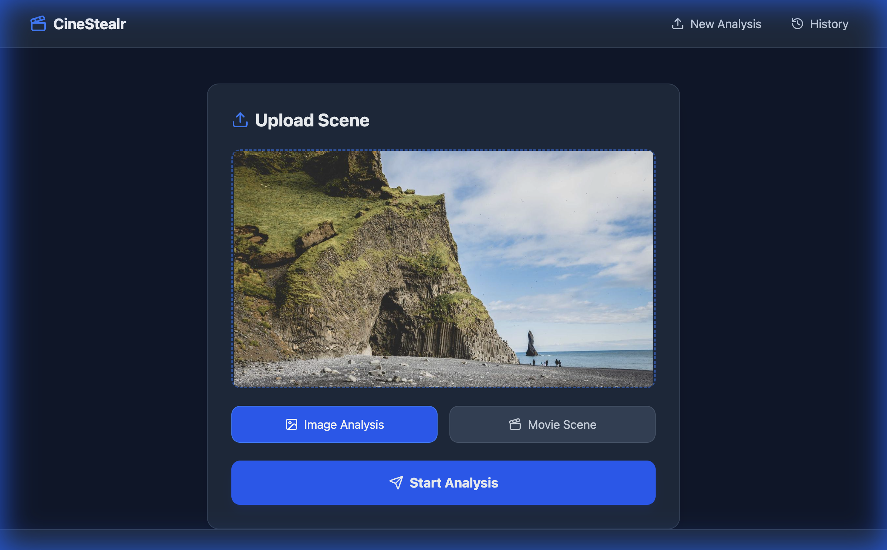
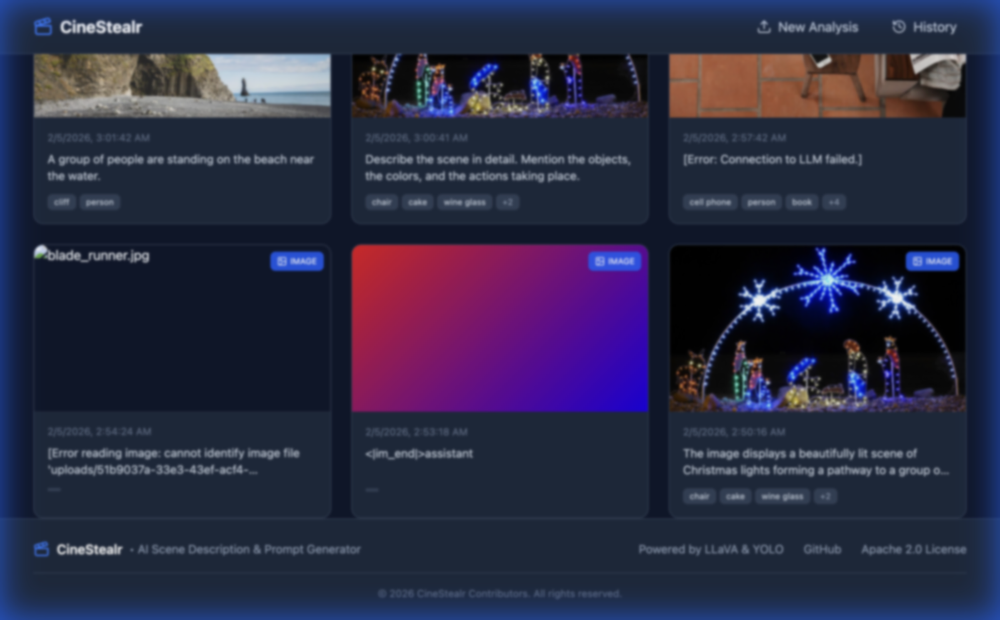
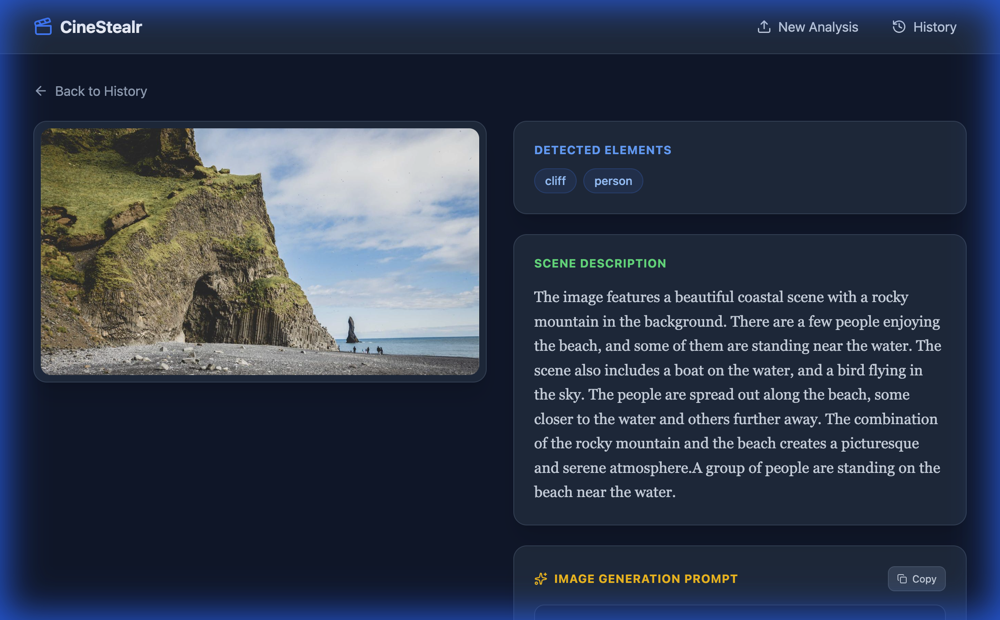

# CineStealr

Local AI application for generating cinematic scene descriptions and image prompts from images using LLaVA and YOLO.

## Features

- 🎬 **Scene Analysis** - Upload images and get detailed cinematic descriptions
- ✨ **Image Prompt Generation** - Create AI image generation prompts for Stable Diffusion, DALL-E, Midjourney
- 🚀 **Metal GPU Acceleration** - Native support for Apple Silicon (M1/M2/M3/M4/M5)
- 📋 **Copy to Clipboard** - One-click copy for generated prompts
- 📜 **History** - Browse and revisit previous analyses

## Screenshots

### Upload Page


### Analysis History


### Scene Analysis & Prompt Generation


## Quick Start

### macOS (Apple Silicon) - Recommended

```bash
# First-time setup (downloads ~4.5GB of AI models)
./cinestealr.sh setup

# Start with Metal GPU acceleration
./cinestealr.sh start
```

### Linux / Intel Mac

```bash
# First-time setup
./cinestealr.sh setup

# Start in container mode (CPU)
./cinestealr.sh start --container
```

### Manual Start

```bash
# Using Podman (native LLM mode for macOS)
./start_llm.sh &
podman compose -f podman-compose.native.yml up -d

# Using Docker (container mode)
docker compose -f podman-compose.yml up -d
```

## Commands

| Command | Description |
|---------|-------------|
| `./cinestealr.sh setup` | First-time setup (download models, install deps) |
| `./cinestealr.sh start` | Start all services (auto-detects best mode) |
| `./cinestealr.sh start --native` | Force native LLM with Metal GPU |
| `./cinestealr.sh start --container` | Force containerized LLM (CPU only) |
| `./cinestealr.sh stop` | Stop all services |
| `./cinestealr.sh status` | Show service status |

## Options

| Option | Description |
|--------|-------------|
| `--native` | Use native LLM with Metal GPU (macOS only) |
| `--container` | Use containerized LLM (CPU only) |
| `--docker` | Use Docker instead of Podman |
| `--podman` | Use Podman (default) |

## URLs

| Service | URL |
|---------|-----|
| Frontend | http://localhost:5173 |
| Backend API | http://localhost:8000 |
| LLM Server | http://localhost:8080 |

## Requirements

### macOS (Native Mode)
- macOS 12+ with Apple Silicon (M1/M2/M3/M4/M5)
- [Homebrew](https://brew.sh)
- Podman or Docker

### Linux / Container Mode
- Podman or Docker with Compose
- 8GB+ RAM recommended

## Architecture

```
┌─────────────┐     ┌─────────────┐     ┌─────────────┐
│  Frontend   │────▶│   Backend   │────▶│  LLM Server │
│   (Vite)    │     │  (FastAPI)  │     │  (LLaVA)    │
│  Port 5173  │     │  Port 8000  │     │  Port 8080  │
└─────────────┘     └─────────────┘     └─────────────┘
```

## License

Apache License 2.0 - see [LICENSE](LICENSE)